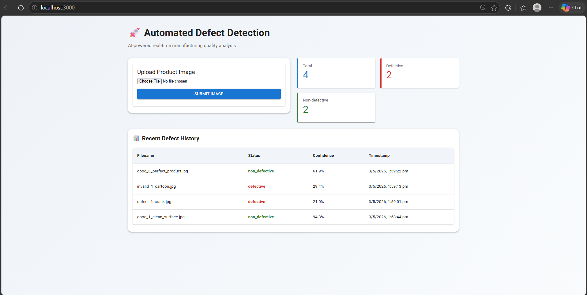
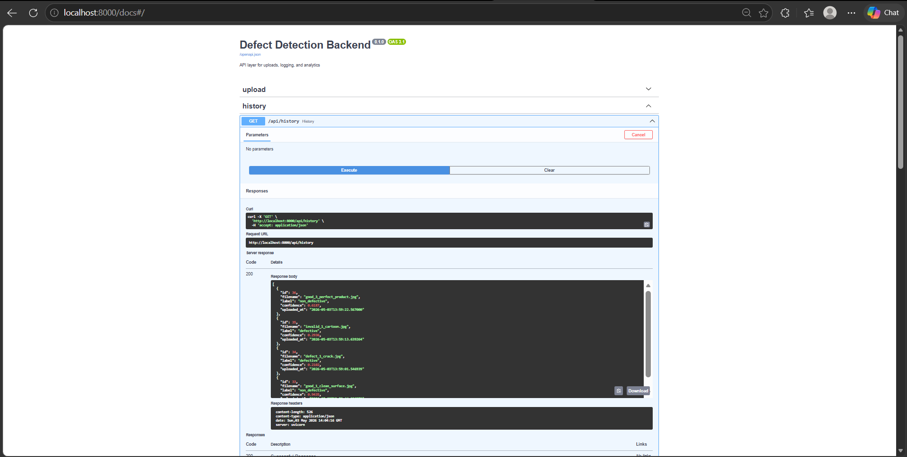

# Automated Defect Detection System

## 🎯 Overview

A production-ready end-to-end system for automated manufacturing defect detection using a Vision Transformer (ViT) inference pipeline. The system performs real-time image classification, logs predictions to a database, and provides a live monitoring dashboard.

**Key Features:**
- ✅ Transformer-based image classification (ViT)
- ✅ FastAPI microservice architecture (Backend + AI Service)
- ✅ Next.js dashboard with real-time updates
- ✅ PostgreSQL logging and analytics
- ✅ Full Docker containerization
- ✅ End-to-end working pipeline (upload → inference → storage → UI)

---

## 📋 Table of Contents

- [Problem Statement](#problem-statement)
- [Solution Architecture](#solution-architecture)
- [Tech Stack](#tech-stack)
- [Project Structure](#project-structure)
- [Quick Start](#quick-start)
- [Demo Flow](#demo-flow)
- [Dataset](#dataset)
- [Limitations](#limitations)

---

## 🧠 Problem Statement

Manufacturing lines require fast and reliable defect detection to ensure product quality. Manual inspection is:

- Time-consuming
- Error-prone
- Inconsistent

This project simulates an automated inspection system using AI-based image classification.

---

## 🏗️ Solution Architecture

The system follows a **microservice-based architecture**:

| Component | Role | Tech |
|-----------|------|------|
| **AI Service** | Runs model inference | FastAPI + PyTorch + Transformers |
| **Backend** | Handles upload, logging, API | FastAPI + SQLAlchemy |
| **Frontend** | Dashboard UI | Next.js + Material UI |
| **Database** | Stores logs | PostgreSQL |

### 🔄 Data Flow
User Upload → Frontend → Backend → AI Service → Prediction  
                     ↓  
        Backend stores result  
                     ↓  
      Frontend updates dashboard
---

## 🛠️ Tech Stack

- **Frontend:** Next.js, Material UI
- **Backend:** FastAPI, SQLAlchemy
- **AI/ML:** Hugging Face Transformers, PyTorch (ViT)
- **Database:** PostgreSQL
- **DevOps:** Docker, Docker Compose

---

## 📂 Project Structure

```text
ai-defect-detection-system/
├── frontend/
│   ├── pages/
│   ├── components/
│   ├── services/
│   └── Dockerfile
├── backend/
│   ├── routes/
│   ├── services/
│   ├── models.py
│   ├── schemas.py
│   └── main.py
├── ai-service/
│   ├── api/
│   ├── inference/
│   ├── training/
│   └── Dockerfile
├── docs/
├── sample_data/
├── assets/
│   ├── dashboard.png
│   └── backend.png
├── docker-compose.yml
├── PROJECT_SUMMARY.md
└── README.md
```

## 🚀 Quick Start

```bash
# Clone project
cd your-project

# Setup environment
cp .env.example .env

# Run system
docker-compose up --build
```

### Access:

- Frontend → http://localhost:3000
- Backend → http://localhost:8000/api
- AI Service → http://localhost:8001

---

## 📊 Demo Flow

1. Upload product image
2. Backend validates input
3. AI service performs inference
4. Result stored in PostgreSQL
5. Dashboard updates instantly

---

## 🧠 Model Details

- Base Model: `google/vit-base-patch16-224`
- Task: Binary classification (`defective` vs `non_defective`)
- Output:

```json
{
  "label": "defective",
  "confidence": 0.87
}
```

### ⚠️ Important Note

- Current model is **not fine-tuned on a domain-specific industrial dataset**
- Uses general pretrained weights
- Suitable for **system demonstration**, not production accuracy

---

## 🗂️ Dataset

### Option 1: MVTec AD

- Industry benchmark dataset
- Recommended for proper training

### Option 2: Sample Data

- Synthetic / random test images
- Used for pipeline validation

---

## 🧪 API Endpoints

### Upload
POST /api/upload

### History
GET /api/history

### Stats
GET /api/stats

---

## 📈 Performance

| Operation    | Time        |
|--------------|-------------|
| Inference    | ~200–500ms  |
| API Response | ~300–600ms  |

---

## 🔐 Security

- File type validation
- File size restriction
- ORM-based DB protection

---

## ⚠️ Limitations

- Model is **not domain-trained**
- Accuracy is not production-grade
- Uses **general ViT classifier**
- No defect localization (classification only)

👉 This project focuses on:

- System design
- Backend architecture
- AI integration pipeline

---

---

## 📸 Screenshots

### Dashboard


### Backend API (Swagger)


## 🚀 Future Improvements

- Train on MVTec AD dataset
- Add defect localization (bounding boxes)
- Improve confidence calibration
- Add model versioning
- Deploy on cloud (AWS/GCP)

---

## 🏁 Summary

This project demonstrates:

- Full-stack engineering
- AI system integration
- Microservice architecture
- Real-time data flow

👉 Built as a **production-style AI system prototype**

---

## 🤝 Contribution

PRs welcome.

---

## 📞 Support

Refer `/docs` folder.

---
